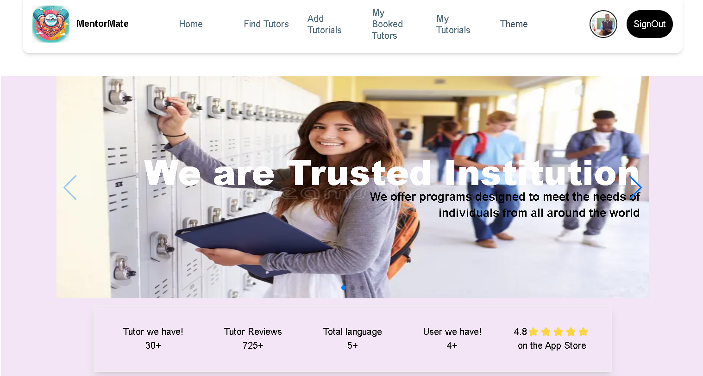

# MentorMate

MentorMate is an innovative online tutor booking platform designed to connect learners with skilled tutors across various languages and subjects. The platform streamlines the process of finding, reviewing, and booking tutors, promoting accessible and flexible learning opportunities globally.

### Live URL
[(https://fretful-airport.surge.sh/)]

## Features

- **Home Page**: A welcoming interface with a banner, stats section, language categories, and additional sections.
- **Find Tutors**: Browse and search for tutors based on language and subject.
- **Add Tutorials**: Easily add new tutorials for users.
- **My Tutorials**: Manage tutorials with options to update or delete.
- **My Booked Tutors**: View and manage booked tutors, with the ability to leave reviews.
- **Tutor Details**: Detailed information about each tutor, including the option to book sessions.
- **Dark/Light Theme**: Toggle between dark and light modes for a personalized experience.
- **Authentication**: Secure email/password login and Google Sign-in with JWT token implementation for private routes.
- **Responsive Design**: Fully optimized for mobile, tablet, and desktop views.
- **Error Handling**: Dedicated error page and loading states for a seamless user experience.

## Key Sections

### Home Page
- **Banner**: Engaging carousel.
- **Stats Section**: Displays tutor, review, language, and user counts.
- **Language Categories**: Nine interactive cards redirecting users to specific tutor categories.
- **Extra Sections**: Additional relevant content to enhance user engagement.

### Find Tutors
- Browse tutors by categories and search functionality.
- View detailed tutor information, including language, price, and reviews.

### Add Tutorials
- Add tutorials with relevant details, stored securely in the database.

### My Tutorials
- View tutorials in a table format with options to update or delete entries.

### My Booked Tutors
- View all booked tutors and leave reviews to increment tutor ratings.

## Deployment

This website contains:
- Responsive and user-friendly design.
- Firebase integration for authentication.
- MongoDB for secure data handling.
- Environment variables for sensitive data.

## Technologies Used

- **Frontend**: React.js, Material Tailwind, React Awesome Reveal, React Icon, Lottie React
- **Backend**: Node.js, Express.js
- **Database**: MongoDB
- **Authentication**: Firebase with JWT implementation

## Dependencies

- **Core Dependencies**:
  - `@emotion/react`
  - `@emotion/styled`
  - `@heroicons/react`
  - `@material-tailwind/react`
  - `@tippyjs/react`
  - `axios`
  - `firebase`
  - `framer-motion`
  - `localforage`
  - `lottie-react`
  - `match-sorter`
  - `next-themes`
  - `react`
  - `react-awesome-reveal`
  - `react-countup`
  - `react-dom`
  - `react-icons`
  - `react-router-dom`
  - `react-tooltip`
  - `sort-by`
  - `swiper`

- **Dev Dependencies**:
  - `@eslint/js`
  - `@types/react`
  - `@types/react-dom`
  - `@vitejs/plugin-react`
  - `autoprefixer`
  - `eslint`
  - `eslint-plugin-react`
  - `eslint-plugin-react-hooks`
  - `eslint-plugin-react-refresh`
  - `globals`
  - `postcss`
  - `tailwindcss`
  - `vite`
  - `vite-tsconfig-paths`

⚡ **Developed with love ❤️ using the MERN Stack!** 

